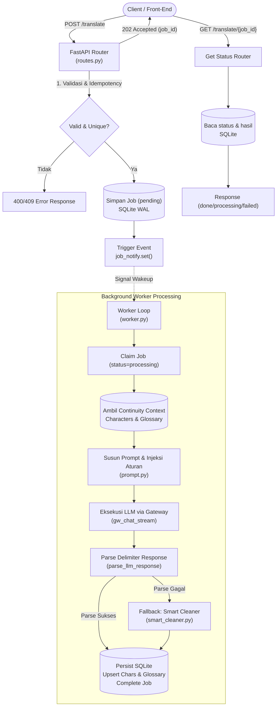
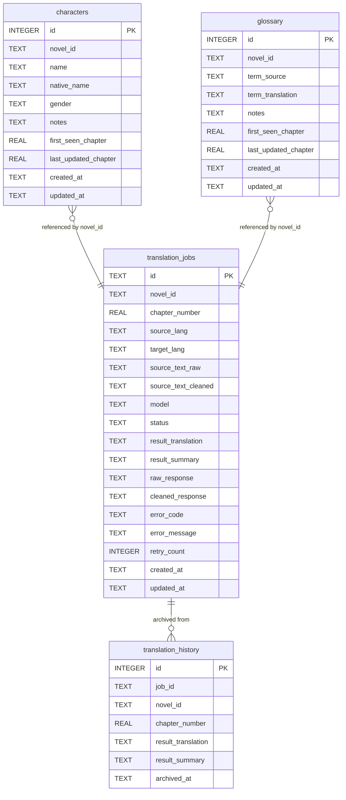

# Dokumentasi Pipeline Penerjemahan (`/translate`) — Hermes ChatGPT Web

Dokumen ini menjelaskan secara menyeluruh arsitektur, tahapan pemrosesan data, logika prompt, parsing respons, manajemen kontinuitas karakter & glosarium, serta strategi ketahanan (*error handling & fallback*) pada pipeline endpoint `/translate`.

---

## 1. Ikhtisar & Arsitektur Pipeline

Pipeline `/translate` dirancang untuk memproses penerjemahan teks novel berseri (bab per bab) secara asinkron (*asynchronous job queue*). Pipeline ini memastikan konsistensi terjemahan antar-bab (*continuity context*), keutuhan gaya bahasa asli, serta pemisahan format visual/media menggunakan *custom plain-text delimiters*.



---

## 2. Struktur Komponen & Lokasi File

| Komponen | Path File | Tanggung Jawab Utama |
| :--- | :--- | :--- |
| **API Router** | `src/hermes_chatgpt_web/translation/routes.py` | Menerima request HTTP, validasi skema payload, idempotensi bab, trigger sinyal worker, dan endpoint status polling. |
| **Background Worker** | `src/hermes_chatgpt_web/translation/worker.py` | Worker asinkron event-driven yang mengambil antrean job, memanggil gateway LLM, mengelola parsing, dan persistensi data. |
| **Image Processor** | `src/hermes_chatgpt_web/translation/image_processor.py` | Ekstraksi tag gambar (Markdown & HTML ``) menjadi placeholder `<<<IMG_n>>>`, serta rekonstruksi kembali menjadi tag HTML `` bersertakan `alt` & `size`. |
| **Prompt Engine** | `src/hermes_chatgpt_web/translation/prompt.py` | Modul perakit sistem prompt multi-bahasa, injeksi aturan khusus, pembungkus context, serta parser delimiter. |
| **Smart Cleaner** | `src/hermes_chatgpt_web/translation/smart_cleaner.py` | State machine parser cadangan untuk memulihkan teks atau format JSON yang rusak/unescaped dari LLM. |
| **Database Layer** | `src/hermes_chatgpt_web/translation/database.py` | Manajemen koneksi dan operasi CRUD SQLite (aiosqlite) berbasis WAL (*Write-Ahead Logging*). |
| **Signal Dispatcher** | `src/hermes_chatgpt_web/translation/signals.py` | Mengelola `asyncio.Event` global (`job_notify`) untuk koordinasi reaktif antara router dan worker. |

---

## 3. Tahapan Lengkap Eksekusi Pipeline

Pipeline pemrosesan berjalan melalui 7 tahapan berurutan:

### Tahap 1: Ingestion & Validasi Request (`POST /translate`)
1. **Validasi Payload JSON**:
   - `model`: Nama model LLM yang akan digunakan (wajib, string).
   - `source_lang`: Kode bahasa sumber (`ko`, `en`, `ja`, `zh`).
   - `target_lang`: Kode bahasa target (`id`, `en`).
   - `novel_id`: Identifier unik dari novel (wajib, string).
   - `chapter_number`: Nomor bab (wajib, angka `int`/`float`).
   - `text`: Teks sumber bab yang akan diterjemahkan (wajib, maksimal karakter sesuai konfigurasi `TRANSLATION_MAX_TEXT_LENGTH`).
   - `force`: Boolean opsi untuk memaksa terjemahan ulang bab yang sudah selesai (*optional*, default `false`).
2. **Pengecekan Idempotensi**:
   - Memeriksa tabel `translation_jobs` untuk kombinasi `(novel_id, chapter_number)`:
     - Jika status masih **`pending`** atau **`processing`**: Kembalikan HTTP `409 Conflict` (`job_already_in_progress`).
     - Jika status **`done`** dan `force: false`: Kembalikan HTTP `409 Conflict` (`chapter_already_translated`).
     - Jika status **`done`** dan `force: true`: Hasil lama diarsipkan ke tabel `translation_history`, job lama dihapus, lalu dibuat job baru.
     - Jika status **`failed`**: Job lama dihapus, sistem mengizinkan pembuatan job baru secara otomatis.
3. **Penyimpanan Job Awal**:
   - Rekord baru dibuat dengan `id` berformat `job_<8_hex_chars>` dan status `pending`.
4. **Wakeup Signal**:
   - Mengeksekusi `job_notify.set()` untuk membangunkan loop background worker seketika.
5. **Respons Cepat**:
   - Mengembalikan HTTP `202 Accepted` beserta metadata job ke client.

---

### Tahap 2: Event-Driven Worker Dispatcher
1. Worker loop di `worker.py` berada dalam kondisi *sleeping* tanpa memakan resource CPU/HTTP:
   ```python
   await asyncio.wait_for(job_notify.wait(), timeout=60)
   ```
2. Ketika ada sinyal masuk (atau saat timeout safety sweep 60 detik tiba), event di-reset (`job_notify.clear()`).
3. Worker mengambil batch job dengan status `pending` dibatasi oleh `WORKER_CONCURRENCY`.
4. Memeriksa kesiapan gateway browser (`gw_status()`). Jika browser belum siap, worker melakukan backoff selama 30 detik.
5. Menjalankan proses per job secara paralel via `asyncio.create_task(_process_job(job))`.

---

### Tahap 3: Job Claiming & Context Assembly
1. **Atomic Claim**:
   - Menjalankan `claim_job(job_id)` untuk mengubah status job menjadi `processing` secara transaksional di SQLite sehingga tidak dieksekusi ganda.
2. **Penyusunan Kontinuitas & Teks**:
   - Seperti halnya glosarium, lampiran karakter dari bab sebelumnya tidak disematkan ke pesan chat/request LLM. Namun LLM tetap mengekstrak karakter dan istilah baru yang muncul di bab tersebut pada format respons.
3. **Ekstraksi Gambar & Placeholder (`extract_images`)**:
   - Seluruh tag gambar baik format Markdown (``) maupun tag HTML (``) diekstrak dari teks sumber dan digantikan sementara dengan placeholder terindeks (`<<<IMG_0>>>`, `<<<IMG_1>>>`, dst.).
   - Hal ini menghemat token dan mencegah LLM merusak/menerjemahkan URL panjang atau tag HTML.
4. **Penyusunan Pesan Prompt (`build_translation_messages`)**:
   - Menggabungkan **System Prompt** (aturan gaya penulisan, pencegahan sensor, larangan ringkasan, pelestarian marker `<<<IMG_n>>>`, konversi formatting ke *custom delimiters*).
   - Menyematkan teks sumber yang sudah dibersihkan dan dibungkus marker:
     ```text
     <<<TEXT_START>>>
     [Isi teks bab dengan placeholder <<<IMG_n>>>]
     <<<TEXT_END>>>
     ```

---

### Tahap 4: Eksekusi LLM via Gateway Stream
1. Menyusun struktur pesan role-based (`[system]` dan `[user]`).
2. Menghubungi endpoint internal `/chat/stream` melalui `gw_chat_stream()` dalam worker thread (`asyncio.to_thread`).
3. Mengalirkan respons secara real-time hingga selesai (`done: true`).
4. **Mekanisme Retry**:
   - Jika terjadi timeout (`TRANSLATION_JOB_TIMEOUT`) atau kegagalan koneksi LLM gateway, worker melakukan retry otomatis dengan jadwal backoff eksponensial (`LLM_BACKOFF_SCHEDULE = [2, 8]` detik).
   - Bila seluruh percobaan gagal, status job diubah menjadi `failed` dengan error code `LLM_API_ERROR`.

---

### Tahap 5: Parsing Delimiter & Smart Cleaning
LLM diinstruksikan untuk mengembalikan output dengan format delimiter khusus:

```text
<<<TRANSLATION_START>>>
[Teks terjemahan lengkap]
<<<TRANSLATION_END>>>

<<<SUMMARY_START>>>
[Ringkasan cerita bab ini (1-3 kalimat)]
<<<SUMMARY_END>>>

<<<CHARACTERS_START>>>
<<<CHAR_START>>>
NAME: [Nama Karakter]
NATIVE_NAME: [Nama Asli / Hangul / Kanji / Hanzi]
GENDER: [male / female / unknown]
STATUS: [new / updated]
NOTES: [Deskripsi peran/hubungan]
<<<CHAR_END>>>
<<<CHARACTERS_END>>>

<<<GLOSSARY_START>>>
<<<TERM_START>>>
TERM_SOURCE: [Istilah Sumber]
TERM_TRANSLATION: [Terjemahan Istilah]
STATUS: [new / updated]
NOTES: [Konteks istilah]
<<<TERM_END>>>
<<<GLOSSARY_END>>>
```

1. **Delimiter Parsing (`parse_llm_response`)**:
   - Melakukan ekstraksi regex untuk setiap blok data.
2. **Fallback Smart Cleaner (`repair_json`)**:
   - Jika parsing mengalami kendala struktural (misalnya format tercampur atau karakter unescaped), fungsi `smart_cleaner` dijalankan untuk memulihkan integritas data.
3. **Restorasi Tag HTML `` (`restore_images`)**:
   - Merekonstruksi setiap placeholder `<<<IMG_n>>>` pada hasil terjemahan kembali menjadi tag HTML ``.
   - Mengikutsertakan atribut ukuran (`width`, `height`, `style`, dll.) jika ada pada input pengguna.
   - Jika atribut `alt` tidak disediakan pada input awal, otomatis di-generate format: `"{novel_id} - Ch. {chapter_number} illustration"`.
4. **Format Transformasi Markdown (`delimiters_to_markdown`)**:
   - Mengubah kembali delimiter tipografi internal menjadi Markdown standar untuk kenyamanan pembacaan:
     - `<<<BOLD>>>teks<<<BOLD_END>>>` $\rightarrow$ `**teks**`
     - `<<<ITALIC>>>teks<<<ITALIC_END>>>` $\rightarrow$ `*teks*`
     - `<<<LINK>>>teks|url<<<LINK_END>>>` $\rightarrow$ `[teks](url)`
     - `<<<HR>>>` $\rightarrow$ `---`
     - Tag HTML `` tetap dipertahankan secara utuh sebagai standar media di web & markdown.

---

### Tahap 6: Persistensi & Sinkronisasi Kontinuitas
1. **Upsert Karakter (`upsert_characters`)**:
   - Jika karakter baru: dimasukkan ke tabel `characters` dengan `gender`, `first_seen_chapter`, `last_updated_chapter`, dan `appeared_chapters = [chapter_number]`.
   - Jika karakter sudah ada:
     - Diperbarui `notes` (digabungkan dengan tag chapter jika ada catatan baru).
     - Jika gender di database saat ini masih bernilai `unknown` dan respons chat mendeteksi gender pasti (`male`/`female`), gender di database otomatis di-upgrade ke gender yang terdeteksi. Jika gender di DB sudah `male`/`female`, gender yang sudah ada tetap dipertahankan.
     - `last_updated_chapter` diupdate ke `chapter_number`.
     - `chapter_number` ditambahkan ke dalam list `appeared_chapters` (tanpa duplikasi).
2. **Penyimpanan Glosarium Baru (`upsert_glossary`)**:
   - Istilah yang diekstrak dari respons LLM diperiksa terhadap database.
   - Jika istilah (`term_source`) sudah ada di database untuk novel ini, istilah diabaikan (mencegah duplikasi).
   - Jika istilah belum ada, disimpan sebagai entri glosarium terbaru.
3. **Penyelesaian Job (`complete_job`)**:
   - Menyimpan `result_translation`, `result_summary`, `raw_response`, dan `cleaned_response`.
   - Mengubah status job menjadi **`done`**.
   - Menyertakan mekanisme retry hingga 3 kali jika database SQLite sedang terkunci (*busy handler*).

---

### Tahap 7: Pengambilan Hasil (`GET /translate/{job_id}`)
Client dapat memantau progres atau mengambil hasil akhir melalui endpoint polling:
- Saat job selesai (`done`), respons memuat:
  - `result.translation`: Teks hasil terjemahan dalam format delimiter murni.
  - `result.translate_md`: Teks hasil terjemahan yang sudah dikonversi ke Markdown siap pakai.
  - `result.chapter_summary`: Ringkasan plot dari bab tersebut.
  - `raw_response` & `cleaned_response`: Log payload mentah untuk debugging dan audit.
- Saat job gagal (`failed`), respons memuat objek `error` dengan informasi `code`, `message`, dan `retry_count`.

---

## 4. Skema Database SQLite

Pipeline menggunakan 4 tabel relasional di database SQLite (`translation.db`) dengan mode `PRAGMA journal_mode=WAL;`:



---

## 5. Ringkasan Status & Error Handling

| Kode Error | Penyebab | Tindakan Sistem |
| :--- | :--- | :--- |
| `model_required` | Field `model` kosong pada request. | Tolak request (HTTP 400). |
| `unsupported_source_lang` | Kode bahasa sumber tidak didukung (`ko`, `en`, `ja`, `zh`). | Tolak request (HTTP 400). |
| `unsupported_target_lang` | Kode bahasa target tidak didukung (`id`, `en`). | Tolak request (HTTP 400). |
| `text_too_long` | Panjang teks sumber melampaui batas maksimum. | Tolak request (HTTP 400). |
| `job_already_in_progress` | Bab sedang diproses oleh worker lain. | Tolak request (HTTP 409). |
| `chapter_already_translated` | Bab sudah pernah selesai diterjemahkan. | Tolak request (HTTP 409), sarankan `force: true`. |
| `LLM_TIMEOUT` / `LLM_API_ERROR` | Gateway browser atau ChatGPT tidak merespons. | Retry otomatis dengan backoff; jika gagal ubah status ke `failed`. |
| `LLM_INVALID_JSON` | Format delimiter respons dari model tidak valid. | Lakukan smart clean fallback; jika tetap gagal tandai `failed`. |
| `SQLITE_WRITE_ERROR` | Terjadi deadlock atau database lock saat persistensi. | Retry hingga 3 kali; jika gagal catat status `failed`. |

---

## 6. Fitur Manajemen Tambahan

- **Manual Job Retry (`POST /translate/{job_id}/retry`)**: Mengulang kembali job yang gagal dengan menggunakan teks yang telah dibersihkan sebelumnya.
- **Job Cancellation (`DELETE /translate/{job_id}`)**: Menghapus atau membatalkan job tertentu dari antrean.
- **Context Inspection (`GET /translate/novel/{novel_id}/context`)**: Menampilkan daftar karakter dan kamus istilah yang telah terkumpul untuk novel tertentu.
- **Chapter Context Query (`GET /translate/novel/{novel_id}/chapters/{chapter_number}`)**: Mengambil hasil terjemahan lengkap beserta konteks karakter dan glosarium per bab.
